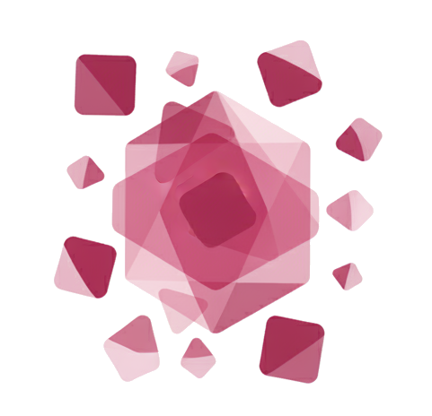

<p align="center">
  
</p>

# PLASMA for Claude

_The application takes shape around you. Software without software._

**PLASMA** (_Programmable Layer for Adaptive Synthetic Media & Applications_) defines a new approach to software development where an agent dynamically generates applications based on the state of the conversation with the user and the data it can access.

The agent writes the application as you talk to it. Not from a template: it generates the actual HTML, CSS, and JavaScript on the fly based on what you need.

The application is not static once generated. There is a feedback loop: every user action (a click, a form submission, a selection) flows back to the agent carrying full context, not just "button clicked" but the current form state, the selected values, whatever is relevant. The agent perceives what the user did, reasons about it, and mutates the application in response. The app is alive. It transforms with every interaction.

There are no predefined components. The agent has access to the full browser runtime: DOM, Canvas, WebGL, Three.js, D3, fragment shaders, anything you can load from a CDN. If the browser can run it, the agent can build it.

Every mutation is saved and numbered. The whole history is replayable, forkable, and persists across sessions. Event sourcing, but applied to the UI layer.

PLASMA for Claude is a system that lets Claude Desktop, Claude Code, and Cowork generate and control fully interactive web applications rendered directly on your macOS desktop, in real time.

For full documentation visit **[helloplasma.org](https://helloplasma.org)**.

## Components

It is made up of three components that work together:

| Component | What it is | What it does |
|-----------|-----------|-------------|
| **[Plasma Surface](plasma-surface/)** | A native macOS menubar app | Renders the HTML/CSS/JS interfaces that Claude creates, and captures your interactions (clicks, inputs, form submissions) |
| **[Plasma MCPB](plasma-connector/)** | An MCP server bundle (extension .mcpb) | Opens a bidirectional communication channel between Claude and the Surface app via WebSocket |
| **[Plasma Plugin](plasma-plugin/)** | A Claude plugin (zip file) | Teaches Claude how to use the MCPB tools effectively, includes skills, best practices, and slash commands |

In short: the Plugin provides the brain, the MCPB provides the bridge, and the Surface provides the screen.

## Installation

### Step 1: Install the Plasma Surface (macOS App)

The Surface is a lightweight menubar application for macOS.

1. Download the latest release from the [Plasma Surface releases page](https://github.com/hello-plasma/claude-components/releases).
2. Move the app to your Applications folder.
3. Launch it. You'll see a small icon appear in your macOS menu bar.

That's it. The Surface is now listening on `ws://localhost:9420` and waiting for content.

> **Note:** The Surface only accepts connections from localhost, so no network exposure is involved.
>
> Or build from source: `cd plasma-surface && swift build -c release`

### Step 2: Install the MCPB Extension

The MCPB (MCP Bundle) is what gives Claude the actual tools to communicate with the Surface. Think of it as a bridge that Claude can talk through.

1. Locate the `plasma-1.0.0.mcpb` file (it comes with the [Plasma distribution](https://github.com/hello-plasma/claude-components/releases)).
2. Open **Claude Desktop**.
3. Go to **Settings**.
4. Look for the **MCP / Extensions** section.
5. Drag and drop the `.mcpb` file into the settings window, or use the "Add" button to browse and select it.

Claude Desktop will register the extension and make its tools available.

Once installed, Claude gets access to tools like `dynamic_ui_render`, `plasma_create`, `wait_for_ui_event`, and others. It won't know the best way to use them yet. That's what the Plugin is for.

### Step 3: Install the Plasma Plugin

The Plugin is a zip file containing skills, commands, and best practices. It teaches Claude how to build with Plasma effectively.

1. Download `plasma-plugin.zip` from the [releases page](https://github.com/hello-plasma/claude-components/releases).
2. Open **Claude Desktop**.
3. Go to **Settings**.
4. Look for the **Capabilities** section.
5. Click on **Skills** / go to **Customize**.
6. Click the **+** icon, then select **Upload Skill**.
7. Drag and drop the `.zip` file into the upload window.

Claude will add the plugin and its skills will be available immediately.

Once installed, you'll have access to these slash commands:

| Command | What it does |
|---------|-------------|
| `/plasma:start` | Check that everything is connected and ready |
| `/plasma:create` | Create a new interactive app |
| `/plasma:load` | Load a previously saved app |
| `/plasma:list` | See all your saved apps |

### Step 4: Verify

After installing all three components, run this command in a Claude conversation:

```
/plasma:start
```

Claude will check the connection to the Surface and confirm everything is working.

### What now?

The sky is the limit. Imagine Claude pulling data through its connectors and dynamically creating navigation forms, documents, diagrams, slide decks, 2D and 3D visualizations. Every action you take is perceived by Claude and used to reshape the interface in real time, enriching your experience as you go. The application takes shape around you. Software without software.

## License

Apache 2.0. See [LICENSE](plasma-plugin/LICENSE).
